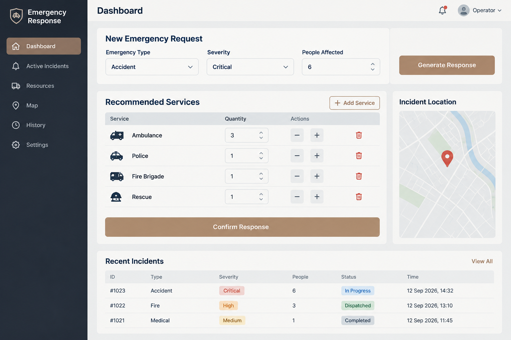

# Intelligent Emergency Response & Traffic Coordination System

The Intelligent Emergency Response & Traffic Coordination System (IERTCS) is designed to enhance the efficiency and effectiveness of emergency response operations. The system integrates various components to ensure that emergency services can respond quickly and safely to incidents.

Emergency occurs → identify required service → select best vehicle → select suitable destination → calculate safest/fastest route → coordinate traffic signals → continuously monitor → re-plan if conditions change.

Therefore, this system is hybrid system that combines two parts:

**1.Algorithmic:** A route optimization, resource allocation, traffic-signal scheduling.

**2.AI-based:** Emergency classification, fuzzy reasoning, prediction of traffic/hospital load, intelligent decision-making, and dynamic re-planning.

Therefore, we require a total of 6 integrated systems that can handle all these tasks in real-time.

1. **Emergency Detection**
2. **Emergency Vehicle Allocation Engine**
3. **Hospital / Destination Selection**
4. **Route Planning & Optimization**
5. **Traffic Signal Coordination**
6. **Continuous Monitoring & Re-planning**

## 1. Emergency Detection

Emergency Detection work is to allote the special severvices to the emergency. Before selecting an ambulance, police vehicle, or
fire brigade, our system needs to understand:

*What happened, where did it happen, how serious is it, and what resources are required?*

Since we are working in the **simulation** so this we didn't need the any intaligent system that will check all this things, we just want on **input of three values** from the user. Not to 10 values.

1. **Severity**: Only seleted value Low, Moderate, High, Critical.
2. **Number of people affected**
3. **Type of Emargency**: Where Emergency Type can be selected with one tap, for example:

```text
    🚑 Medical
    🚗 Accident
    🔥 Fire
    🚔 Crime
    🏢 Collapse
    🌊 Disaster
```

### Chosing Requirment

Now this is the main part, now we have to think of the what should be input values of the next stage ```Emergency Vehicle Allocation Engine``` that will be output for this subsystem. So our output is as follows:

#### Output

The subsystem should produce a standard object like:

``` json

Emergency {
    id,
    type,
    location,
    severity,
    people_affected,
    timestamp,
    required_services,
    confidence
}
```

Now we have **3 input** and have to genrate the **8 Output**. There for this system should be is the rule base system such as:

``` text

IF severity = Critical
AND people_affected > 5
THEN
    Ambulance = 3
    Fire/Rescue = 1
    Police = 1
```

So instance of the AI we should use the **Expert System**, Because this decision is based on **known emergency-response rules**, not something we need to *learn* from thousands of examples.

### Desing Part

Let's discuss about the Expert System and UI part.

#### **Expert system**

We design it as two separate things: the **Knowledge Base** and the **Inference Engine**

1. **Knowledge Base Structure**

    Knowledge Base = *Collection of emergency-response rules.*

    We should not hardcode the if-else rules directly into the program.

    Instead:

    Knowledge Base<br>
    &nbsp; &nbsp;  ↓ <br>
    Rules stored as data <br>
    &nbsp; &nbsp; ↓ <br>
    Inference Engine <br>
    &nbsp; &nbsp;  ↓ <br>
    Decision <br>

    For example,

    Store the rule in JSON:
    ```json
        {
            "id": "R01",
            "conditions": {
            "type": "accident",
            "severity": "critical",
            "people": ">5"
            },
            "result": {
            "services": ["ambulance", "police", "rescue"]
            }
        }
    ```
    Then the Python *Inference Engine* reads the rules and checks whether the *user's input matches them*.

2. **Inference Engine structure**

    The Inference Engine is the part that takes the user's input and checks the Knowledge Base to determine what rules apply.

    We choose the inference method, such as forward chaining or backward chaining.

    • **Forward Chaining:** Start with the facts → apply rules → reach a conclusion.

    • **Backward Chaining:** Start with a possible conclusion → work backward to see whether the facts support it.

    For my system, I am using Forward Chaining.

    How It Works

    FACTS <br>
    &nbsp; &nbsp; ↓ <br>
    Check rules<br>
    &nbsp; &nbsp;  ↓ <br>
    Matching rules <br>
    &nbsp; &nbsp;  ↓ <br>
    New conclusions <br>
    &nbsp; &nbsp;  ↓ <br>
    Check more rules <br>
    &nbsp; &nbsp; ↓ <br>
    Final decision <br>

#### UI part

Here we desing the dashbord that will take the inpute form the user and form that input we predicte the service.The **dashboard** provides a **simple interface** for **creating** and **managing emergency requests**.

 • **Emergency Type:** Select the type of emergency. <br>
 • **Severity:** Select the severity level. <br>
 • **People Affected:** Enter the number of affected people. <br>
 • **Generate Response:** Sends the inputs to the Expert System. <br>
 • **Recommended Services:** Displays the services and number of units required. <br>
 • **Modify Services:** User can add, remove, or change the quantity of services. <br>
 • **Confirm Response:** Confirms the final required services and passes them to the next subsystem. <br>

**dashbord desing Ex**

<p align="center">

</p>

And here the Emergency detection part is clear