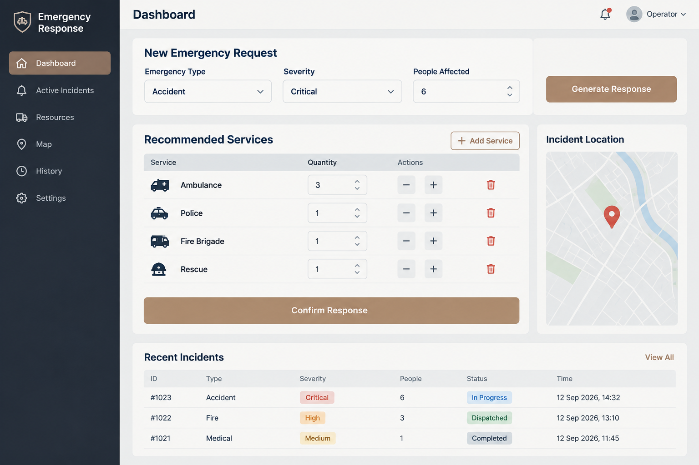
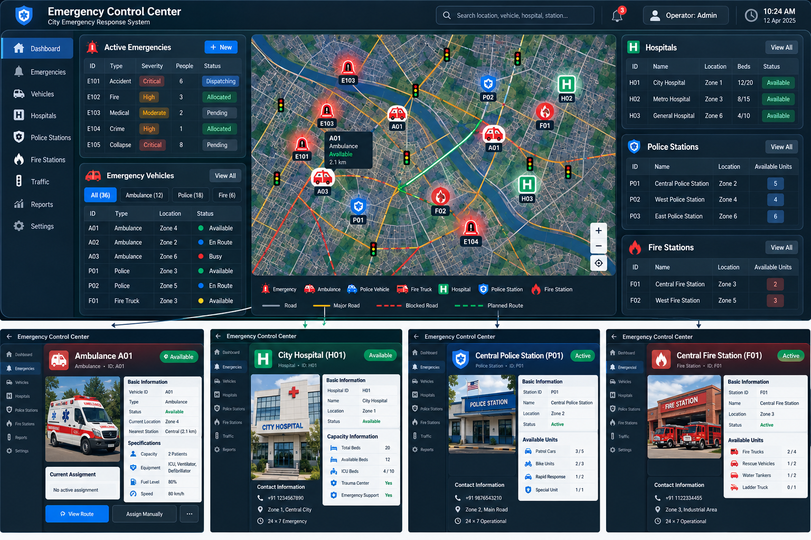
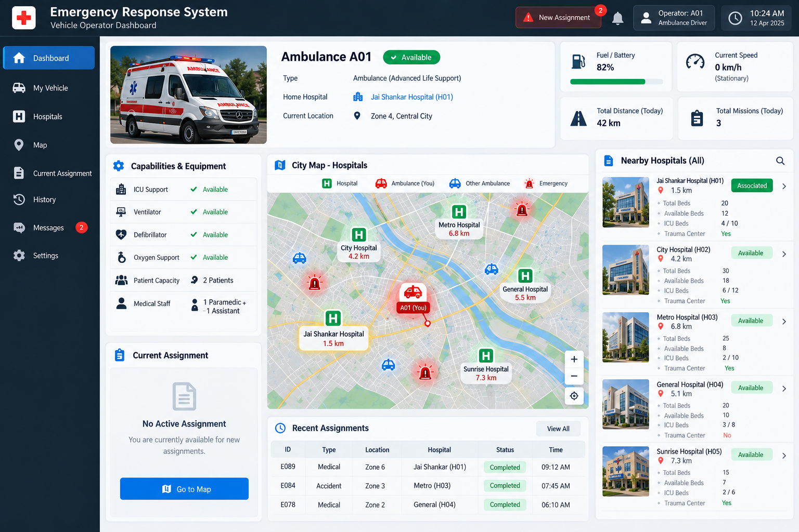
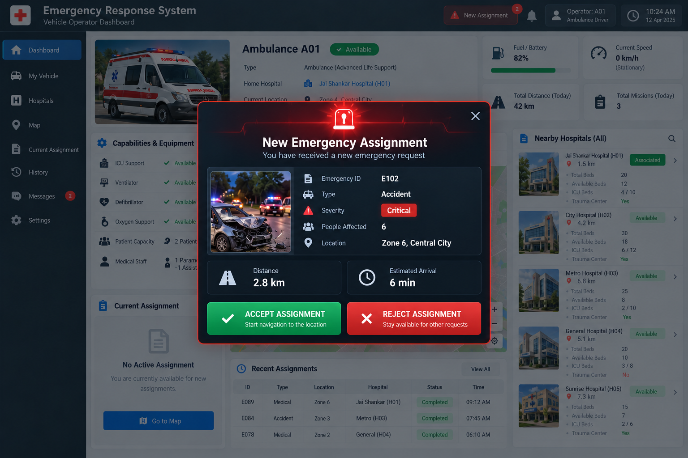

# Intelligent Emergency Response & Traffic Coordination System

The Intelligent Emergency Response & Traffic Coordination System (IERTCS) is designed to enhance the efficiency and effectiveness of emergency response operations. The system integrates various components to ensure that emergency services can respond quickly and safely to incidents.

Emergency occurs → identify required service → select best vehicle → select suitable destination → calculate safest/fastest route → coordinate traffic signals → continuously monitor → re-plan if conditions change.

Therefore, this system is hybrid system that combines two parts:

**1.Algorithmic:** A route optimization, resource allocation, traffic-signal scheduling.

**2.AI-based:** Emergency classification, fuzzy reasoning, prediction of traffic/hospital load, intelligent decision-making, and dynamic re-planning.

Therefore, we require a total of 6 integrated systems that can handle all these tasks in real-time.

1. **Emergency Detection**
2. **Emergency Vehicle Allocation Engine**
3. **Hospital / Destination Selection**
4. **Route Planning & Optimization**
5. **Traffic Signal Coordination**
6. **Continuous Monitoring & Re-planning**

## 1. Emergency Detection

Emergency Detection work is to allote the special severvices to the emergency. Before selecting an ambulance, police vehicle, or
fire brigade, our system needs to understand:

*What happened, where did it happen, how serious is it, and what resources are required?*

Since we are working in the **simulation** so this we didn't need the any intaligent system that will check all this things, we just want on **input of three values** from the user. Not to 10 values.

1. **Severity**: Only seleted value Low, Moderate, High, Critical.
2. **Number of people affected**
3. **Type of Emargency**: Where Emergency Type can be selected with one tap, for example:

```text
    🚑 Medical
    🚗 Accident
    🔥 Fire
    🚔 Crime
    🏢 Collapse
    🌊 Disaster
```

### Chosing Requirment

Now this is the main part, now we have to think of the what should be input values of the next stage ```Emergency Vehicle Allocation Engine``` that will be output for this subsystem. So our output is as follows:

#### Output

The subsystem should produce a standard object like:

``` json

Emergency {
    id,
    type,
    location,
    severity,
    people_affected,
    timestamp,
    required_services,
    confidence
}
```

Now we have **3 input** and have to genrate the **8 Output**. There for this system should be is the rule base system such as:

``` text

IF severity = Critical
AND people_affected > 5
THEN
    Ambulance = 3
    Fire/Rescue = 1
    Police = 1
```

So instance of the AI we should use the **Expert System**, Because this decision is based on **known emergency-response rules**, not something we need to *learn* from thousands of examples.

### Desing Part

Let's discuss about the Expert System and UI part.

#### **Expert system**

We design it as two separate things: the **Knowledge Base** and the **Inference Engine**

1. **Knowledge Base Structure**

    Knowledge Base = *Collection of emergency-response rules.*

    We should not hardcode the if-else rules directly into the program.

    Instead:

    Knowledge Base<br>
    &nbsp; &nbsp;  ↓ <br>
    Rules stored as data <br>
    &nbsp; &nbsp; ↓ <br>
    Inference Engine <br>
    &nbsp; &nbsp;  ↓ <br>
    Decision <br>

    For example,

    Store the rule in JSON:
    ```json
        {
            "id": "R01",
            "conditions": {
            "type": "accident",
            "severity": "critical",
            "people": ">5"
            },
            "result": {
            "services": ["ambulance", "police", "rescue"]
            }
        }
    ```
    Then the Python *Inference Engine* reads the rules and checks whether the *user's input matches them*.

2. **Inference Engine structure**

    The Inference Engine is the part that takes the user's input and checks the Knowledge Base to determine what rules apply.

    We choose the inference method, such as forward chaining or backward chaining.

    • **Forward Chaining:** Start with the facts → apply rules → reach a conclusion.

    • **Backward Chaining:** Start with a possible conclusion → work backward to see whether the facts support it.

    For my system, I am using Forward Chaining.

    How It Works

    FACTS <br>
    &nbsp; &nbsp; ↓ <br>
    Check rules<br>
    &nbsp; &nbsp;  ↓ <br>
    Matching rules <br>
    &nbsp; &nbsp;  ↓ <br>
    New conclusions <br>
    &nbsp; &nbsp;  ↓ <br>
    Check more rules <br>
    &nbsp; &nbsp; ↓ <br>
    Final decision <br>

#### UI part

Here we desing the dashbord that will take the inpute form the user and form that input we predicte the service.The **dashboard** provides a **simple interface** for **creating** and **managing emergency requests**.

 • **Emergency Type:** Select the type of emergency. <br>
 • **Severity:** Select the severity level. <br>
 • **People Affected:** Enter the number of affected people. <br>
 • **Generate Response:** Sends the inputs to the Expert System. <br>
 • **Recommended Services:** Displays the services and number of units required. <br>
 • **Modify Services:** User can add, remove, or change the quantity of services. <br>
 • **Confirm Response:** Confirms the final required services and passes them to the next subsystem. <br>

**Accienent dashbord desing Ex**

<p align="center">

</p>

## 2. Emergency Vehicle Allocation Engine

### UI Design

The Emergency Vehicle Allocation Engine contains two main types of interfaces:

   1. Central Control Dashboard: It should give the **operator** a live view of the **whole** **simulated city**, not just the currently selected emergency.
   2. Transport/Vehicle Dashboard:


**1. Central Control Dashboard**

The central dashboard provides an overview of all emeargency vehicles operating in the simulated city.

The **Central Control Dashboard** is used by the **emergency operator** to view available vehicles, view emeragnecy place, view the all avaliable hospital and there info,  all police steation and fire stations and manage vehicle allocation.


**Important Information**

* Active emergency
* Required emergency services
* Available vehicles
* Vehicle type
* Vehicle ID
* Current location
* Current status
* Distance from emergency
* Assignment status
* Estimated arrival time

The dashboard also contains a **city map** showing:

* Emergency locations
* Available vehicles
* Assigned vehicles
* Hospitals
* Roads
* Traffic conditions

    ***Central-Bord should have the accisiablity to the every Vehical, Hospital, Police and fire station***

Main UI Components

<p align="center">

</p>


**2. Transport / Vehicle oprator profile profile**

The **Transport Dashboard** is used by **individual emergency vehicles** such as ambulances, police vehicles, and rescue vehicles to receive and manage assignments and vehicla speciacs.


Oprator have its own vechical profile and he can see it's emegency sevies places. Like a ambulance sould see all hospital althout it way for  form him, and He sould be assosiated with one emergncy sevies palce. Like Ambulance A12 is assosiated with the jai shankar hospital.

So for this we should have our User profile like this

<p align="center">

</p>
The same concept is used for:

* 🚑 Ambulance
* 🚓 Police Vehicle
* 🚒 Fire/Rescue Vehicle

However, the information shown can be different depending on the vehicle's capabilities.

**1. Vehicle Allotment Interface**

When the allocation engine selects a vehicle, the corresponding transport receives an assignment.

<p align="center">

</p>
**2. Vehicle Status** 

Each vehicle maintains a real-time status:


| Status          | Meaning                                      |
| --------------- | -------------------------------------------- |
| **Available**   | Vehicle can be assigned                      |
| **Assigned**    | Vehicle has received an emergency assignment |
| **En Route**    | Vehicle is travelling to the emergency       |
| **Arrived**     | Vehicle has reached the emergency location   |
| **Busy**        | Vehicle is currently handling the emergency  |
| **Unavailable** | Vehicle cannot currently be assigned         |

The status is updated by the transport interface and reflected on the Central Control Dashboard.

**UI Flow**

    System 1
       ↓
    Confirmed Required Services
       ↓
    Emergency Vehicle Allocation Engine
       ↓
    Check Available Vehicles
       ↓
    Filter Suitable Vehicles
       ↓
    Allocate Vehicles
       ↓
    ┌───────────────┬───────────────┬───────────────┐
    │ Ambulance UI  │  Police UI    │  Rescue UI    │
    └───────────────┴───────────────┴───────────────┘
            ↓               ↓               ↓
         Accept          Accept          Accept
            └───────────────┼───────────────┘
                            ↓
                      Vehicle Dispatched


### Computetion For System-2

**1. Constraint Filtering**

The important thing is that constraint filtering is basically a **series of tests applied to every vehicle**. A vehicle survives only if it satisfies all mandatory constraints.

1. We start with the emergency requirements

Suppose System 1 has produced:

```text
Emergency ID: E102
Type: Accident
Severity: Critical
People affected: 6

Required:
Ambulance × 3
Police × 1
Rescue × 1
```

System 2 receives this as its input.

---

2. We have a vehicle database

Suppose our simulated city has:

| Vehicle | Type      | Status    | Capability   | Location |
| ------- | --------- | --------- | ------------ | -------- |
| A01     | Ambulance | Available | ICU          | Zone 2   |
| A02     | Ambulance | Busy      | ICU          | Zone 4   |
| A03     | Ambulance | Available | Basic        | Zone 5   |
| A04     | Police    | Available | Standard     | Zone 3   |
| A05     | Ambulance | Available | ICU          | Zone 1   |
| R01     | Rescue    | Available | Heavy Rescue | Zone 6   |

Now the filtering engine processes these vehicles.

---

# 3. First constraint: Vehicle Type

For the ambulance requirement:

```text
Required type = Ambulance
```

The algorithm checks:

```text
A01 → Ambulance → ✓
A02 → Ambulance → ✓
A03 → Ambulance → ✓
A04 → Police    → ✗
R01 → Rescue    → ✗
```

Remaining:

```text
A01
A02
A03
```

---

# 4. Second constraint: Availability

Now:

```text
Required status = Available
```

Check each remaining vehicle:

```text
A01 → Available → ✓
A02 → Busy      → ✗
A03 → Available → ✓
A05 → Available → ✓
```

Now:

```text
A01
A03
A05
```

---

# 5. Third constraint: Capability

Suppose the critical accident requires an ambulance capable of handling serious patients.

We can have a capability requirement such as:

```text
Required capability = ICU
```

Then:

```text
A01 → ICU       → ✓
A03 → Basic     → ✗
A05 → ICU       → ✓
```

Now our eligible set becomes:

```text
A01
A05
```

These are the vehicles that **pass all mandatory constraints**.

---

# 6. Computationally, it looks like this

The important part is that we're not writing:

```python
if ambulance == A01:
    ...
elif ambulance == A02:
    ...
```

Instead, we have **generic constraints**.

Conceptually:

```text
Vehicle
   ↓
Is type correct?
   ↓ YES
Is it available?
   ↓ YES
Does capability match?
   ↓ YES
Is it eligible?
```

For each vehicle:

```text
                    ┌─ Type? ── NO → Reject
                    │
Vehicle ────────────┼─ Available? ── NO → Reject
                    │
                    ├─ Capability? ── NO → Reject
                    │
                    └─ All pass → Eligible
```

---

# 7. In mathematical terms

We can represent each constraint as a Boolean function.

For vehicle \(v\):

$$
C_1(v) = \text{TypeMatch}(v)
$$

$$
C_2(v) = \text{Available}(v)
$$

$$
C_3(v) = \text{CapabilityMatch}(v)
$$

A vehicle is eligible only when:

$$
Eligible(v) = C_1(v) \land C_2(v) \land C_3(v)
$$

Where \(\land\) means **AND**.

So:

```text
A01:
TypeMatch       = True
Available       = True
CapabilityMatch = True

True AND True AND True
= TRUE
```

Therefore:

```text
A01 → ELIGIBLE
```

But:

```text
A03:
TypeMatch       = True
Available       = True
CapabilityMatch = False

True AND True AND False
= FALSE
```

Therefore:

```text
A03 → REJECTED
```

---

# 8. The important part: hard vs soft constraints

This distinction will be useful for our project.

### Hard constraints

If violated, the vehicle **cannot be selected**.

Examples:

```text
Vehicle must be:
✓ Correct type
✓ Available
✓ Operational
✓ Required capability
```

These are handled by the **constraint filter**.

### Soft constraints

These don't eliminate the vehicle. They affect **how desirable it is**.

For example:

```text
Vehicle A01 → 2 km away
Vehicle A05 → 5 km away
```

Both are eligible.

So distance should **not necessarily filter A05 out**.

Instead:

```text
A01 → lower cost
A05 → higher cost
```

That goes into our **cost function + Hungarian Algorithm** afterward.

---

# So the complete System 2 logic is

```text
                 System 1 Output
                       ↓
              Required Services
                       ↓
               Vehicle Database
                       ↓
             ┌─────────────────┐
             │ HARD CONSTRAINTS│
             └────────┬────────┘
                      ↓
             Type compatibility
                      ↓
                Availability
                      ↓
               Capability
                      ↓
             Operational status
                      ↓
              Eligible Vehicles
                      ↓
             ┌─────────────────┐
             │   COST FUNCTION │
             └────────┬────────┘
                      ↓
              Travel time
              Distance
              Workload
              Priority
                      ↓
               Cost Matrix
                      ↓
          Hungarian Algorithm
                      ↓
              Final Allocation
```

So **constraint filtering itself doesn't decide which eligible vehicle is the best**.

It answers only:

> **"Which vehicles are allowed to participate in the allocation?"**

Then the optimization algorithm answers:

> **"Among those vehicles, which assignment gives the lowest overall cost?"**

That's the clean technical separation we want in System 2.


### **2. Cost Function**

Calculate how "expensive" it is to assign each vehicle to an emergency.

### **3. Assignment Optimization**

Use the **Hungarian Algorithm** for the actual vehicle-to-emergency assignment.

---

## 1. Constraint Filtering

This is the first algorithmic layer.

We have:

```text
Emergency Requirements
        +
Vehicle Database
        ↓
Constraint Filtering
        ↓
Eligible Vehicles
```

For example:

```text
Emergency:
Type = Medical
Severity = Critical

Required:
Ambulance × 3
```

Vehicle database:

```text
A01 → Ambulance → Available → ICU
A02 → Ambulance → Busy
A03 → Ambulance → Available → Basic
A04 → Police    → Available
A05 → Ambulance → Available → ICU
```

The filtering algorithm removes:

```text
A02 → Busy ❌
A04 → Wrong vehicle type ❌
```

Remaining:

```text
A01
A03
A05
```

This is basically **constraint satisfaction/filtering**, not AI learning.

---

# 2. Cost Function

Now we need to mathematically represent how suitable each vehicle is.

Instead of saying:

> "A01 looks better."

we calculate a **cost**.

For example:

```text
Cost =
    Travel Time Cost
  + Capability Cost
  + Workload Cost
  + Distance Cost
```

Lower cost = better assignment.

For example:

```text
             Travel   Capability   Workload
A01             3          0           1
A03             5          2           0
A05             4          0           1
```

The exact formula will be designed by us.

For example:

$$
C_{ij} =
w_1T_{ij}
+w_2D_{ij}
+w_3M_{ij}
+w_4W_i
$$

Where:

* \(T\) = estimated travel time
* \(D\) = distance
* \(M\) = capability mismatch
* \(W\) = current workload
* \(w_1,w_2,w_3,w_4\) = weights

This gives us a **cost matrix**.

---

# 3. Hungarian Algorithm

This is the important part.

Suppose we have:

```text
3 emergency requirements

E1 → Ambulance
E2 → Ambulance
E3 → Ambulance
```

and:

```text
A01
A03
A05
A07
```

We calculate the cost of assigning every vehicle to every emergency:

```text
        E1    E2    E3
A01     10     8     12
A03      7     9      6
A05      5    11      8
A07      9     4      7
```

This becomes an **assignment problem**.

The Hungarian Algorithm finds the assignment that minimizes the **total cost**.

So instead of:

```text
Pick nearest vehicle
Pick next nearest
Pick next nearest
```

we do:

```text
                 Cost Matrix
                     ↓
             Hungarian Algorithm
                     ↓
              Optimal Assignment
```

That's the actual mathematical engine.

---

# 4. What happens with multiple emergencies?

This is where it becomes much more interesting.

Suppose:

```text
Emergency E101 → Critical
Emergency E102 → High
Emergency E103 → Moderate
```

and we have limited vehicles.

We can create an overall cost that also incorporates **emergency priority**.

For example:

$$
C_{ij} =
TravelCost
+
CapabilityCost
+
WorkloadCost
+
PriorityPenalty
$$

A critical emergency gets a much stronger penalty for delay.

Then the optimization algorithm tries to minimize the **overall system cost**, rather than optimizing each emergency independently.

---

# So our actual System 2 stack becomes

```text
SYSTEM 2
Emergency Vehicle Allocation Engine

        Input
          ↓
┌───────────────────────┐
│ Constraint Filtering  │
└───────────┬───────────┘
            ↓
     Eligible Vehicles
            ↓
┌───────────────────────┐
│ Cost Function         │
│                       │
│ ETA                   │
│ Distance              │
│ Capability            │
│ Workload              │
│ Emergencriority    │
└───────────┬───────────┘
            ↓
       Cost Matrix
            ↓
┌───────────────────────┐
│ Hungarian Algorithm   │
└───────────┬───────────┘
            ↓
     Vehicle Assignment
            ↓
      Transport UI
```

### And this gives us a clean distinction:

| System       | Technique                   |
| ------------ | --------------------------- |
| **System 1** | Expert System               |
|              | Knowledge Base              |
|              | Inference Engine            |
|              | Forward Chaining            |
| **System 2** | Constraint-based allocation |
|              | Cost Function               |
|              | Assignment Optimization     |
|              | Hungarian Algorithm         |

Then **System 3, Dynamic Route Planning**, can use another proper algorithm such as **A***.

So the project isn't pretending that everything is "AI". Each subsyste m uses the computational technique that actually fits its problem. That's a much stronger architecture.
